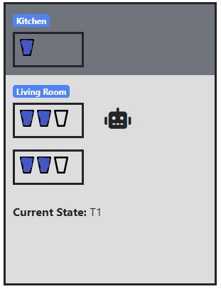

# JS Servus Planning Robot
At a party, you have the robot Servus whose job is to get drinks in the kitchen and place them on two
table in the living room. Your guests are disciplined and pick up glasses at these tables and also put the glasses back on
these tables - if there is room. Servus can carry 2 glasses (full or empty) and a quarter of the tables have space
to 3 glasses (full or empty).

# Demo
**LIVE DEMO:** https://jsfiddle.net/eriksv88/dba7ctos/34/show

# Description
1. Observe the status of the quarter board
2. Load an appropriate number of full glasses in the kitchen
3. Move to one of the tables
4. Put out full and take in empty glasses. There must be room at Servus and on the table.
5. Choose whether to go to the other table or return to the kitchen
- a. Alternative 1 - go ahead and do as in step 4
- b. Option 2 - go to the kitchen
6. When Servus is back in the kitchen, Servus will unload the empty glasses. It should not be
full glasses with back to the kitchen.
The goal for Servus after one round is that
- There are as many full glasses on the tables as possible,
- As few empty glasses on the tables as possible,
- Servus is back in the kitchen, has nothing in his hands and has done this with so few
actions as possible.

# Credit
This code is rewritten from Python.
This application uses code from course [INFO180 at UiB](https://www.uib.no/en/course/INFO180). And is originally written by [Bjornar Tessem](https://www.uib.no/personer/Bj%C3%B8rnar.Tessem). 

