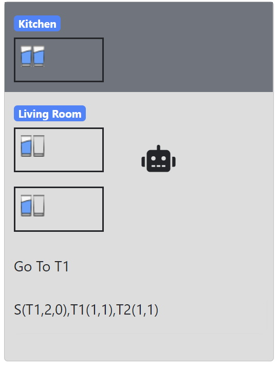

# JS Servus Planning Robot
At a party, you have the robot Servus whose job is to get drinks in the kitchen and place them on two
table in the living room. Your guests are disciplined and pick up glasses at these tables and also put the glasses back on
these tables - if there is room. Servus can carry 2 glasses (full or empty) and a quarter of the tables have space
to 3 glasses (full or empty).

# Demo
https://jsfiddle.net/eriksv88/dba7ctos/1/show

# Credit
This code is rewritten from python.
This application uses code from course INFO180 at UiB. And is originally written by Bjornar Tessem.
